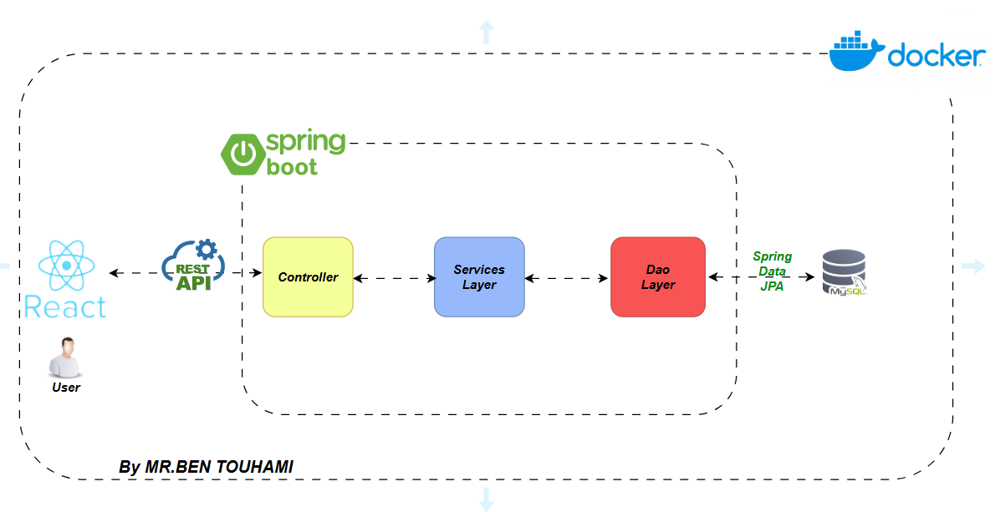

# Exam Planification Application

## Abstact :

Developed a robust, user-friendly platform to streamline the exam scheduling process, focusing on the efficient 
management of exams and room assignments. This application is built
to address both administrative and pedagogical needs, enhancing efficiency and accuracy in exam organization.

## Architecture :

 
## Tech Stack:
- **Backend** : `Spring Boot`, `Spring Data JPA`, `REST API`
- **Frontend** : `React.js`
- **Containerization** : `Docker` 🐳
- **Database** : `MySQL` 🗄️

## Key Features:
- **Exam Scheduling** : Automatically or manually plan exams and assign rooms efficiently.
- **Educational Elements Management** : Add and manage subjects, courses, and their coordinators.
- **Group Creation** : Create custom groups of teachers, whether from different departments, the same sector, or arbitrarily assigned groups to streamline exam coordination.
- **Room Allocation** : Assign rooms based on availability and capacity.

## How To Run :

### Step 1 : Clone the project from github :

```bash 
git clone https://github.com/BenTouhami-MR/ExamPlanificationApp
 ```

### Step 2 : Run docker containers : 

```bash 
docker compose up --build
 ```

***Here are the containers that you have to see on the docker desktop :***


### Step 3 : Access the Application
To access the application, open your browser and go to:

```
http://localhost:3000
```

You will be redirected to the login page (http://localhost:3000/login)

Use the following credentials to log in:

- **Email**: `admin@examPlanification.com`
- **Password**: `admin`
<br/>
<br/>

